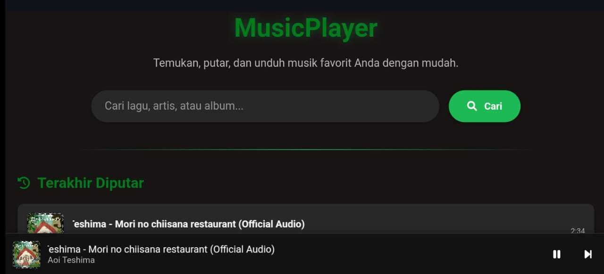

# AXD Player — Premium Music Streaming Experience

<p align="center">
  
</p>

## 🎵 Overview

**AXD Player** adalah aplikasi web pemutar musik modern yang dirancang untuk memberikan pengalaman streaming premium ala Spotify langsung di browser Anda. Aplikasi ini memungkinkan pengguna untuk mencari lagu dari YouTube, memutarnya secara instan, dan mengunduhnya dalam format MP3 dengan kualitas tinggi. Sekarang didukung oleh backend **Express.js** dan siap dideploy ke **Vercel**.

## ✨ Features

- **Spotify-Inspired UI** - Antarmuka bersih, minimalis, dan intuitif dengan tema gelap premium.
- **Pencarian Cepat** - Cari jutaan lagu, artis, atau album dari database YouTube.
- **Pemutaran Tanpa Batas** - Streaming musik langsung tanpa gangguan iklan di antara lagu.
- **Smart Download MP3** - Simpan lagu ke perangkat dengan nama file yang sesuai dengan judul musik.
- **Riwayat & Rekomendasi** - Pantau lagu yang baru diputar dan temukan lagu baru di halaman utama.
- **Navigasi Cerdas** - Mendukung tombol "Kembali" sistem (HP) dan UI tanpa keluar dari aplikasi.
- **Responsive & Modern**:
  - **Desktop Sidebar**: Navigasi tradisional yang nyaman.
  - **Mobile Mini-Player**: Kontrol ringkas saat menjelajah hasil pencarian.
  - **Loading Bar Minimalis**: Indikator progres yang elegan di bagian atas layar.
- **Full Player Mode** - Tampilan layar penuh dengan cover album yang artistik.

## 🚀 Teknologi

AXD Player dibangun menggunakan stack teknologi modern:

- **Backend**: [Node.js](https://nodejs.org/) & [Express.js](https://expressjs.com/)
- **Frontend**: [HTML5](https://developer.mozilla.org/en-US/docs/Web/HTML), [Tailwind CSS](https://tailwindcss.com/)
- **Ikonografi**: [Lucide Icons](https://lucide.dev/)
- **Animasi**: [AOS (Animate On Scroll)](https://michalsnik.github.io/aos/)
- **Deployment**: Ready for [Vercel](https://vercel.com/)
- **API**: Siputzx API (YouTube Search & MP3 Conversion)

## 📁 Struktur Project

Proyek ini mengikuti standar struktur aplikasi Express.js:

```
music-player-main/
│
├── public/                 # File Statis (Frontend)
│   ├── css/
│   │   ├── ss.jpg          # Preview Image
│   │   └── style.css       # Custom Utilities
│   ├── js/
│   │   ├── config.js       # API & Defaults
│   │   └── script.js       # Frontend Logic
│   └── index.html          # Main Application Page
│
├── server.js               # Express Server & Entry Point
├── package.json            # Dependencies & Scripts
├── vercel.json             # Vercel Deployment Config
├── LICENSE                 # Project License
└── README.md               # Documentation
```

## 🆕 Perubahan Terbaru (v2.0)

1. **Migrasi ke Express.js**: Dari statis murni menjadi aplikasi berbasis server Node.js.
2. **Redesain Total**: Mengadopsi gaya Spotify dengan List View untuk pencarian dan Album Cards untuk history.
3. **Optimasi Pengunduhan**: Penanganan polling API yang lebih stabil dan penamaan file dinamis.
4. **Vercel Support**: Konfigurasi otomatis untuk penginstalan satu klik di Vercel.
5. **UI Minimalis**: Mengganti overlay loading dengan progress bar tipis yang modern.

## 🔧 Cara Penggunaan

### Instalasi Lokal

1. **Clone repositori**
   ```bash
   git clone https://github.com/your-username/music-player.git
   cd music-player
   ```

2. **Install Dependensi**
   ```bash
   npm install
   ```

3. **Jalankan Server**
   ```bash
   npm start
   ```
   Akses aplikasi di: `http://localhost:3000`

### Deployment ke Vercel

1. Hubungkan repository GitHub Anda ke Vercel.
2. Vercel akan otomatis mendeteksi file `vercel.json` dan mengonfigurasi build.
3. Klik **Deploy** dan nikmati musik Anda online!

## 🙏 Kredit & Atribusi

- **Siputzx API** - Penyedia API inti untuk konten musik.
- **YouTube** - Sumber data lagu terbesar.
- **AlfiXD** - Developer & Creator.
- **FlowFalcon** - Kontributor awal.

---

Made with ❤️ by **AlfiXD** & **Gemini CLI**
